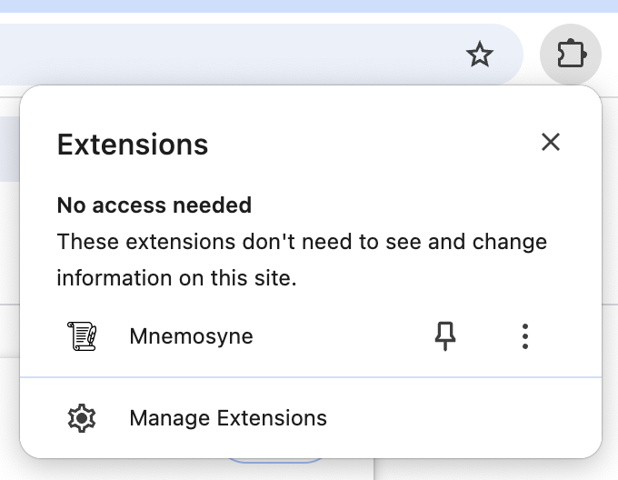

# Mnemosyne

Mnemosyne (neh-moss-eh-knee) is a browser extension that helps you remember and find tweets you've seen. Every tweet you view is saved and searchable. 

Install it, browse X/Twitter, and click the Mnemosyne icon in the toolbar (pictured below) to search your viewed tweets.

Ah I found the tweet 💆‍♂️

## Installation

This has not been published to the Chrome Web Store yet. 

Until then, you can load it into Chrome manually.

### Option 1: Chrome Webstore

https://chromewebstore.google.com/detail/tweet-saver/cakcggfbfmefemdgnhmikkbbhipkfkjm

### Option 2: Build from source

1. Clone the repository.
2. Run `npm ci` to install the dependencies.
3. Run `npm run build` to build the extension.
4. Open Chrome (or any Chromium based browser) and navigate to `chrome://extensions`.
5. Enable "Developer mode" in the top right corner.
6. Click "Load unpacked."
7. Select the `dist` directory.

## Credits

- <a href="https://www.freepik.com/icons/scroll">Toolbar icon of a scroll by Freepik</a>
- Typescript extension scaffolding: https://github.com/chibat/chrome-extension-typescript-starter
